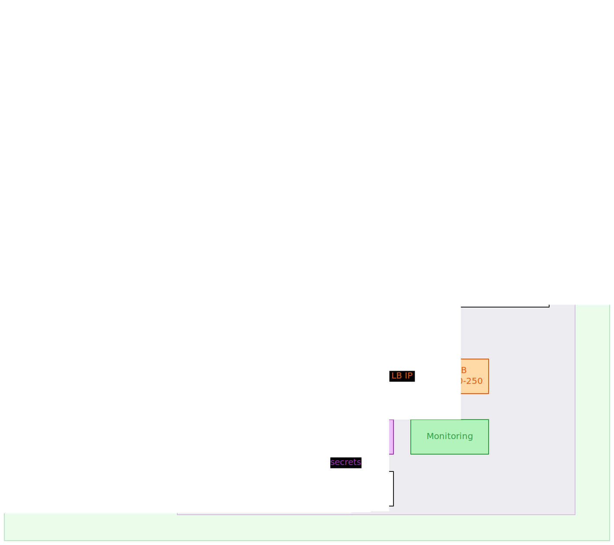
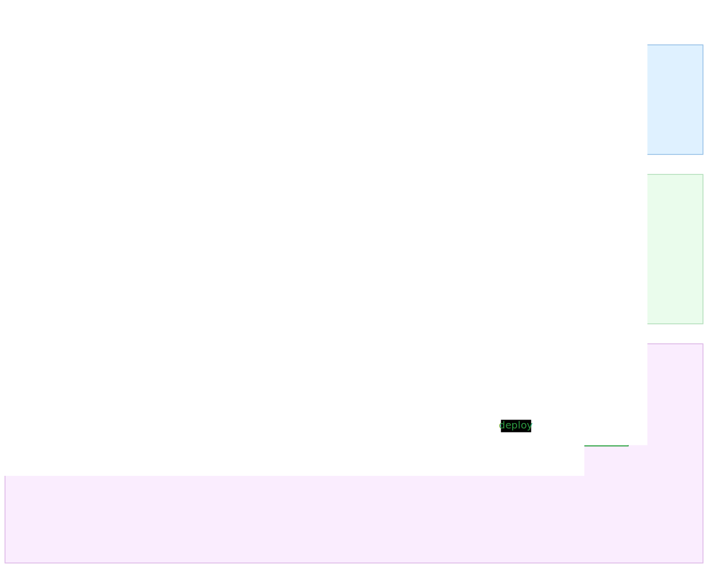

# Homelab

This repository documents a self-hosted homelab built around Proxmox, Kubernetes, automation, and systems practice.

The current primary project in this repo is a Kubernetes platform running on Proxmox with GitOps, LAN load balancing, external access through Cloudflare Tunnel, and a separate Jenkins VM for CI.

## Current Kubernetes Platform

- Proxmox host: `turtle` at `10.0.0.19`
- Cluster build path: Terraform + Ubuntu cloud-init template + Kubespray
- Cluster nodes:
  - `k8s-cp1` `10.0.0.101`
  - `k8s-w1` `10.0.0.102`
  - `k8s-w2` `10.0.0.103`
- External app path: `Cloudflare Tunnel VM -> ingress-nginx LoadBalancer 10.0.0.240 -> app services`
- Delivery path: `git push -> GitHub -> Jenkins -> GHCR -> Git update -> Argo CD -> Kubernetes`

## Architecture Diagrams

### Infrastructure



### CI/CD And GitOps



## Current Architecture

### Platform Foundation

- Proxmox provides the base virtualization layer for the lab
- Terraform provisions Kubernetes VMs from an Ubuntu 24.04 cloud-init template
- Kubespray installs the Kubernetes cluster
- `kubectl` and Helm are used from the Mac admin machine

### Network And Traffic Flow

- MetalLB provides bare-metal `LoadBalancer` IPs on the LAN
- `ingress-nginx` is exposed at `10.0.0.240`
- A separate `cloudflared` VM publishes that ingress entry through Cloudflare Tunnel
- Application routing stays inside Kubernetes `Ingress` resources

### Delivery And Operations Flow

- Jenkins runs on its own Proxmox VM, outside the cluster
- Jenkins handles CI, image builds, and Git updates
- GHCR stores container images
- Argo CD watches Git and applies desired state into the cluster
- Longhorn provides persistent storage for stateful workloads
- Sealed Secrets is the current GitOps-friendly secret workflow
- Monitoring is provided by `kube-prometheus-stack`

## Current Platform Components

Installed now:

- Argo CD
- ingress-nginx
- MetalLB
- Cloudflare Tunnel on a separate VM
- Longhorn
- Sealed Secrets
- monitoring with `kube-prometheus-stack`
- Jenkins on a separate VM

Not current-state yet:

- `cert-manager`
- logging / Loki
- first real application rollout
- deeper security hardening phases

## Current Focus

The most active area in this repo is the self-hosted Kubernetes platform under `docs/` and `notes/k8s/cluster-formation/easy/`.

That work includes:

- Proxmox VM provisioning
- Kubernetes cluster formation
- ingress and LAN exposure design
- Cloudflare Tunnel routing
- Jenkins-based CI
- GitOps delivery with Argo CD
- storage, secrets, and monitoring setup

## Repository Structure

```text
docs/                         Current Kubernetes platform documentation
docs/diagrams/                Architecture diagrams and Excalidraw source
notes/
  ansible/                    Ansible learning and automation notes
  images/                     Supporting images and assets
  jenkins/                    Jenkins lab files and experiments
  k8s/                        Kubernetes learning, cluster setup, and Helm
  networking/                 Networking notes, labs, and study mapping
  openshift/                  OpenShift on Proxmox configs and documentation
  red-hat-enterprise-linux/   RHEL and RHCSA-related notes
  terraform/                  Terraform-related notes and experiments
```

## Where To Start

- [Platform overview](docs/README.md)
- [Argo CD](docs/argocd/README.md)
- [NGINX Ingress Controller](docs/ingress-nginx/README.md)
- [MetalLB](docs/metallb/README.md)
- [Cloudflare Tunnel](docs/cloudflare-tunnel/README.md)
- [Storage / Longhorn](docs/storage/README.md)
- [Secrets management](docs/secrets/README.md)
- [Monitoring](docs/monitoring/README.md)
- [Jenkins](docs/jenkins/README.md)
- [Cluster formation notes](notes/k8s/cluster-formation/easy/)

## Other Lab Areas

This repo still includes broader homelab work outside the current Kubernetes platform focus:

- OpenShift on Proxmox
- Linux and RHCSA-style administration practice
- networking labs and study notes
- Terraform and Ansible learning
- Jenkins experiments and CI/CD practice

## Lab Hardware

- Platform: Proxmox VE
- Host: HP 840
- Memory: 64 GB RAM
- Storage: 500 GB
- CPU: dual Intel Xeon E5-2660 v3

## Principles

- Build, break, fix, and document
- Prefer repeatable workflows over one-off success
- Keep secrets and generated state out of Git
- Use the repo as both working documentation and operational reference

## Summary

This homelab is a hands-on environment for learning infrastructure, Kubernetes, automation, networking, Linux administration, and CI/CD by building real systems and documenting the results.
